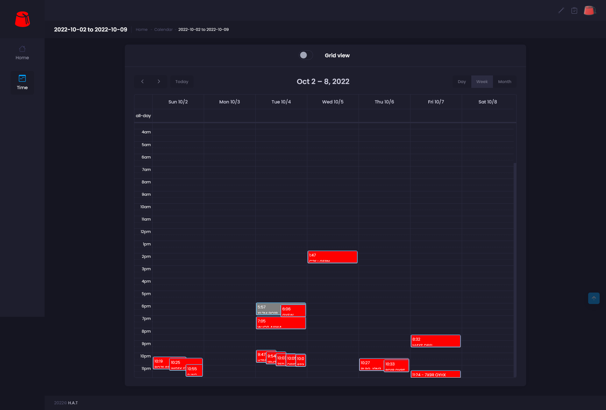

# Memento

> As web-scaling is more of a witchcraft than an exact science, it is currently on a **closed/invite-only beta** status.

## About

Memento is a cloud-based HUD for The Binding of Isaac game (AB+/Repentance). It gives you the ability to :
- **Track** your skill progress over time, 
- **Share** your live/best runs to your friends, 
- **Help** the community to explore the beautiful complexity and randomness of this game.

This pet project was originally an attempt to "port" **[BrokenRemote]( https://github.com/MasterQ32/BrokenRemote )** mod to Repentance, and reworking its UI to a more web-friendly one along the way.

Memento's mod became simply a way to **live datamine** the game's info and save it on [*some else's computer*](https://en.wikipedia.org/wiki/Cloud_computing), thus allowing some interesting use-cases :

- As a player, you're not only able to track your skillz over the time, but also allows you to share your progress/Omega run with your friends.
- As a modder, it may be a great way to live debug/test your mod's impact on the game.
- As a speedrunner, this can be considered as a "Tool-Assisted" help to track/organize better tailored challenges/events.

> It's not the Deadgod but the adventure along the way.

## Screenshots

### Calendar view

### List view

### Run view

### Dashboard view

